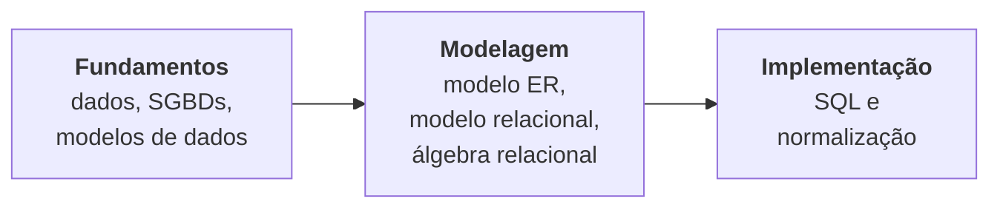

# Aula 01 · Apresentação da disciplina e ambiente de prática

<div class="resumo-aula" markdown>
[:material-file-pdf-box: Slides (em breve)](#){ .md-button }
[:material-arrow-right: Próxima: Fundamentos de BD e SGBDs](02-fundamentos-sgbd.md){ .md-button .md-button--primary }
</div>

!!! abstract "Objetivos"
    - Conhecer a ementa, o cronograma e a forma de avaliação da disciplina.
    - Saber onde encontrar aulas, materiais, códigos e listas neste site.
    - Instalar o PostgreSQL e carregar o banco de exemplo usado nas aulas.

## Vídeo da aula

!!! note "Vídeo em breve"
    A gravação desta aula será publicada aqui.

## 1. Como a disciplina funciona

- **Ementa, objetivos, avaliação e bibliografia:** na [página da disciplina](../index.md).
- **Datas das aulas, listas e provas:** no [cronograma](../cronograma.md).
- **Cada aula** tem o texto completo, o vídeo (quando houver), os slides e exercícios de fixação.
- **Listas avaliadas** ficam em *Listas de exercícios*, no menu à esquerda.

A disciplina segue um caminho em três etapas:



## 2. Preparando o ambiente

Usaremos o **PostgreSQL**, um SGBD relacional gratuito e muito usado no mercado.

1. Instale o PostgreSQL ([instruções na página da disciplina](../index.md#ambiente-de-pratica)).
2. Baixe o script [`universidade.sql`](https://github.com/edurdneto/Ciencia-da-Computacao/blob/main/codigo/banco-de-dados/universidade.sql) — o banco de exemplo das aulas.
3. Crie e carregue o banco:
    ```bash
    createdb universidade
    psql -d universidade -f universidade.sql
    ```
4. Teste: abra `psql -d universidade` e rode:
    ```sql
    SELECT * FROM curso;
    ```
    Se aparecerem três cursos, está tudo certo.

!!! tip "Comandos úteis do `psql`"
    `\dt` lista as tabelas · `\d aluno` mostra a estrutura da tabela `aluno` · `\q` sai.

!!! question "Não conseguiu instalar?"
    Sem problema para começar: nas primeiras aulas o foco é conceitual. Até a aula de SQL, use o [DB Fiddle](https://www.db-fiddle.com/) (escolha PostgreSQL e cole o script) ou procure o professor no horário de atendimento.

## Para a próxima aula

Pense em um sistema que você usa todo dia (banco, rede social, sistema acadêmico, delivery). **Que dados ele guarda? Quem usa esses dados?** Vamos usar esses exemplos na [Aula 02](02-fundamentos-sgbd.md).
