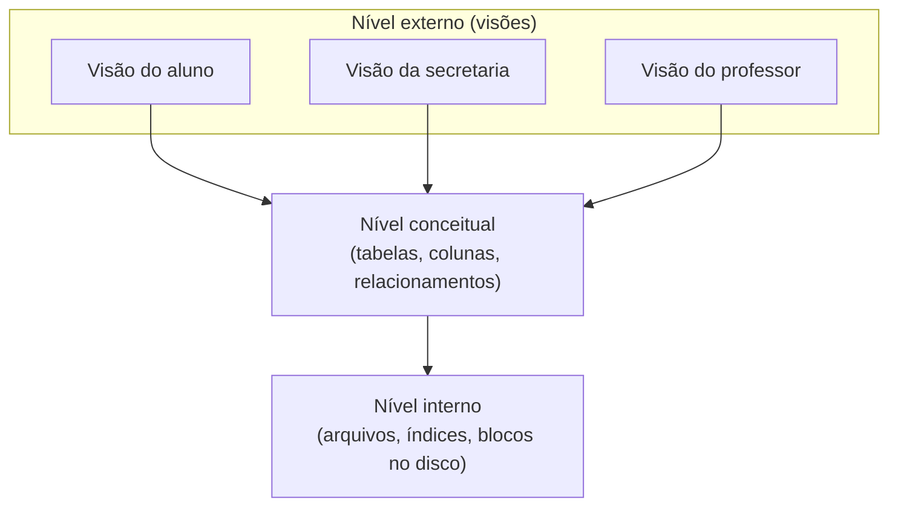

# Aula 01 · Introdução a Bancos de Dados

<div class="resumo-aula" markdown>
[:material-file-pdf-box: Slides (em breve)](#){ .md-button }
[:material-arrow-right: Próxima: SQL básico](02-sql-consultas.md){ .md-button .md-button--primary }
</div>

!!! abstract "Objetivos"
    - Diferenciar **dado**, **informação**, **banco de dados** e **SGBD**.
    - Entender os problemas de guardar dados em arquivos comuns.
    - Conhecer a arquitetura em três níveis e a independência de dados.
    - Instalar o PostgreSQL e carregar o banco de exemplo.

## Vídeo da aula

!!! note "Vídeo em breve"
    A gravação desta aula será publicada aqui.

## 1. Conceitos básicos

| Termo | Definição | Exemplo |
|---|---|---|
| **Dado** | Fato bruto, sem contexto | `8.5` |
| **Informação** | Dado com significado | "Lucas tirou 8,5 em Programação I" |
| **Banco de dados** | Coleção organizada de dados relacionados | Os dados acadêmicos da universidade |
| **SGBD** | Software que cria, mantém e dá acesso ao banco | PostgreSQL, MySQL, Oracle, SQLite |

## 2. Por que não usar planilhas ou arquivos?

Imagine a secretaria guardando tudo em várias planilhas. Problemas que aparecem:

- **Redundância e inconsistência:** o endereço do aluno está em 3 planilhas; alguém atualiza só uma.
- **Dificuldade de acesso:** "quais alunos de Fortaleza têm média abaixo de 5?" exige trabalho manual.
- **Integridade:** nada impede uma nota 15 ou uma matrícula num curso que não existe.
- **Acesso concorrente:** duas pessoas editando o mesmo arquivo ao mesmo tempo perdem alterações.
- **Segurança:** é difícil permitir que o aluno veja só as próprias notas.

Um SGBD resolve isso com uma linguagem de consulta (SQL), restrições de integridade, controle de concorrência, recuperação após falhas e controle de acesso.

## 3. Arquitetura em três níveis



- **Independência lógica:** mudar o nível conceitual (ex.: acrescentar uma coluna) sem quebrar as visões dos usuários.
- **Independência física:** mudar como os dados são armazenados (ex.: criar um índice) sem mudar o esquema conceitual.

## 4. Preparando o ambiente

1. Instale o PostgreSQL ([instruções na página da disciplina](../index.md#ambiente-de-pratica)).
2. Baixe o script [`universidade.sql`](https://github.com/edurdneto/Ciencia-da-Computacao/blob/main/codigo/banco-de-dados/universidade.sql).
3. Crie e carregue o banco:
    ```bash
    createdb universidade
    psql -d universidade -f universidade.sql
    ```
4. Teste: abra `psql -d universidade` e rode `SELECT * FROM curso;`.

!!! tip "Comandos úteis do `psql`"
    `\dt` lista as tabelas · `\d aluno` mostra a estrutura da tabela `aluno` · `\q` sai.

## Para praticar

1. Cite um sistema que você usa no dia a dia e que certamente usa um banco de dados. Que dados ele guarda?
2. Dê um exemplo de inconsistência que poderia acontecer se a universidade guardasse os dados em planilhas separadas.

## Leitura recomendada

- Elmasri & Navathe, *Sistemas de Banco de Dados*, capítulos 1 e 2.
