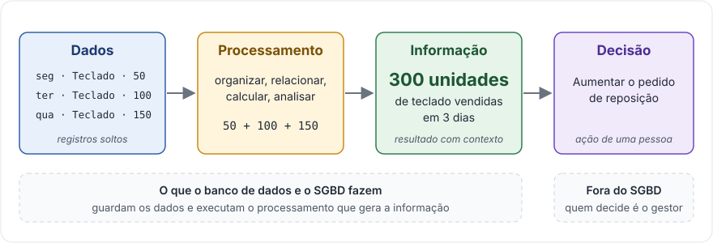
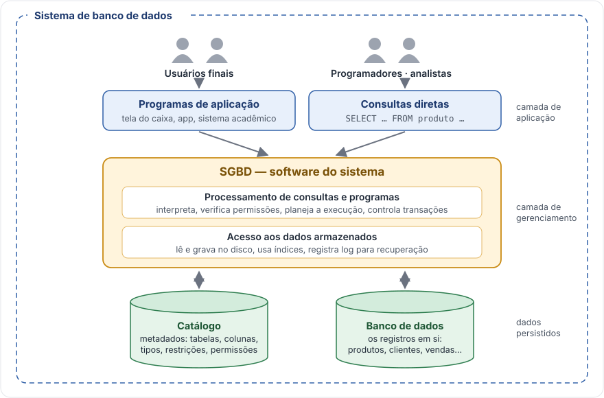
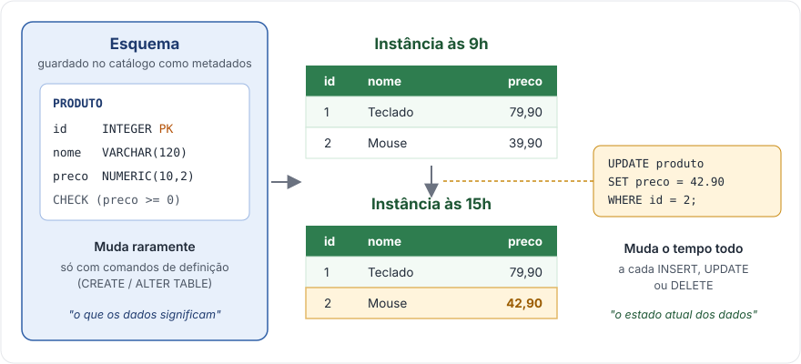
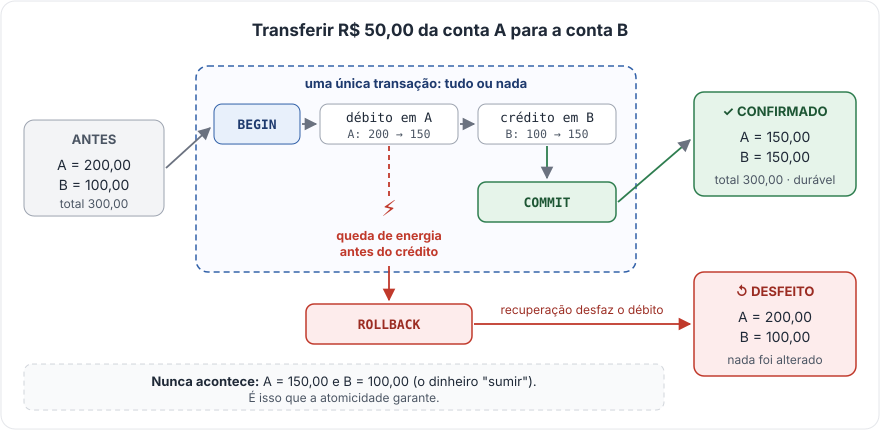
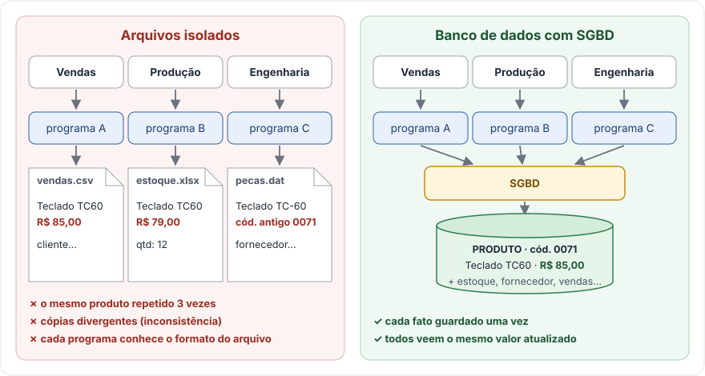
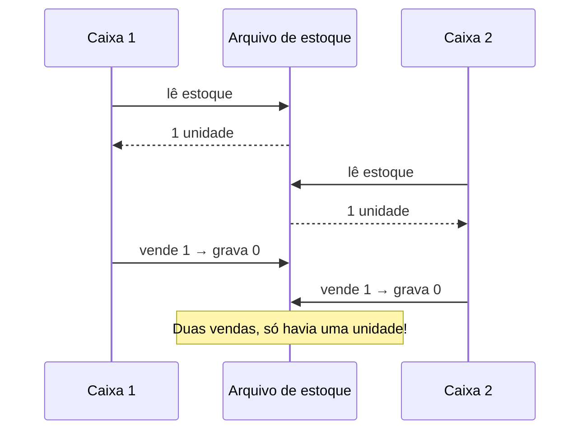
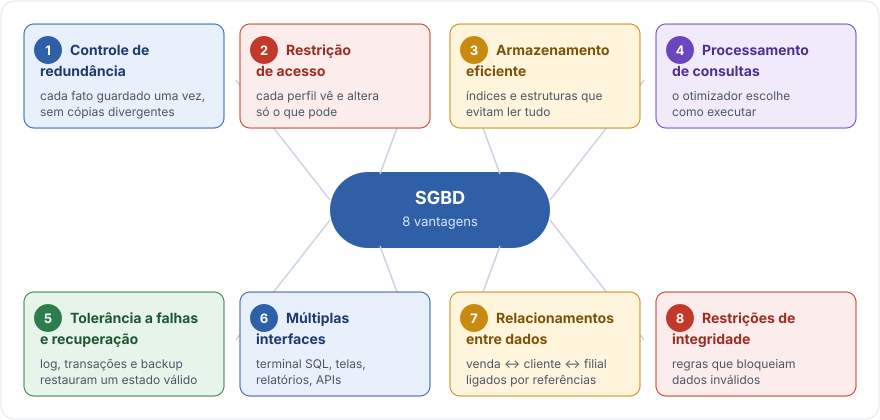
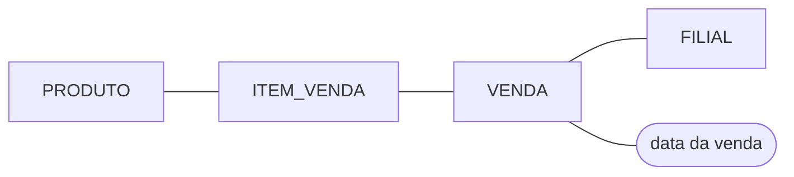
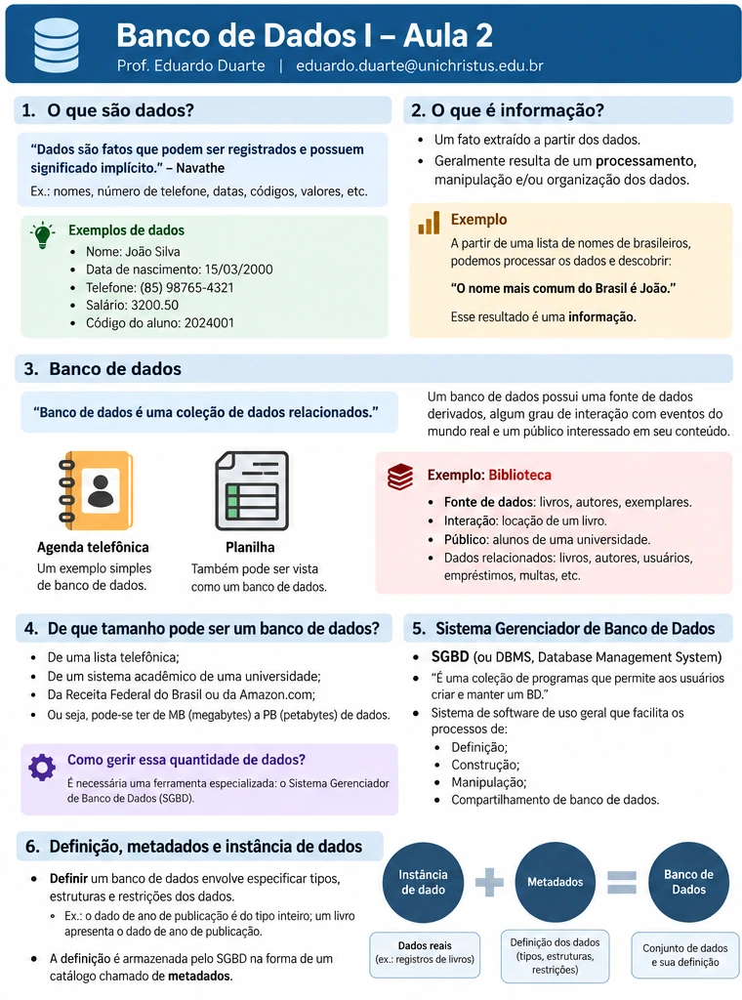

# Aula 02 · Fundamentos de bancos de dados e SGBDs

<div class="resumo-aula" markdown>
[:material-file-pdf-box: Slides (em breve)](#){ .md-button }
[:material-image-text: Resumo visual](#resumo-visual){ .md-button }
[:material-github: Código da aula](https://github.com/edurdneto/Ciencia-da-Computacao/tree/main/codigo/banco-de-dados/aula-02){ .md-button }
[:material-pencil: Exercícios de fixação](#13-exercicios-de-fixacao){ .md-button .md-button--primary }
</div>

!!! quote "Ideia central"
    Guardar dados não é suficiente. Sistemas reais precisam **organizar, consultar, compartilhar, proteger e atualizar** informações de maneira coerente. Um Sistema Gerenciador de Banco de Dados (SGBD) reúne mecanismos para atender a essas necessidades.

!!! abstract "Objetivos de aprendizagem"
    Ao término desta aula, espera-se que você consiga:

    1. Diferenciar **dado**, **informação**, **banco de dados**, **SGBD** e **sistema de banco de dados**.
    2. Reconhecer **esquema**, **instância**, **metadados**, **consultas**, **aplicações** e **transações**.
    3. Explicar problemas típicos de aplicações que armazenam dados em arquivos isolados.
    4. Descrever as principais vantagens e os limites da adoção de um SGBD.
    5. Relacionar controle de acesso, índices, restrições de integridade, concorrência e recuperação a problemas concretos.
    6. Resolver situações-problema e justificar quando um SGBD pode ou não ser adequado.

??? info "Como ler este material"
    Este texto é uma versão **ampliada** dos slides da Aula 2. As seções marcadas como **Aprofundamento** e os exemplos novos complementam, mas não substituem, os slides.

    | Seções deste material | Slides | Tema |
    |---|---:|---|
    | 1–3 | 3–6 | Dados, informação e definição de banco de dados |
    | 4–6 | 7–11 | SGBD, definição, metadados, aplicações e transações |
    | 7 | 12–13 | Evolução histórica |
    | 8 | 14–18 | Limitações de sistemas baseados em arquivos |
    | 9–10 | 19–28 | Benefícios dos SGBDs e exemplo da fábrica |
    | 11–14 | 29–33 | Fixação, gabarito e aprofundamentos |

## Vídeo da aula

<!--
PROFESSOR: troque o bloco "Vídeo em breve" por:
<div class="video">
  <iframe src="https://www.youtube-nocookie.com/embed/ID_DO_VIDEO" title="Aula 02 · Fundamentos de BD e SGBDs" allowfullscreen></iframe>
</div>
-->

!!! note "Vídeo em breve"
    A gravação desta aula será publicada aqui.

---

## 1. O que são dados?

Elmasri e Navathe definem **dados como fatos que podem ser registrados e que possuem significado implícito**. Um nome, uma data, o identificador de um livro, uma quantidade vendida e uma temperatura são exemplos de dados. O significado depende do **contexto**.

Veja registros ainda sem interpretação:

| Registro | Tipo aparente | O que falta para interpretá-lo? |
|---|---|---|
| `42` | Número inteiro | 42 o quê: alunos, reais, anos, unidades? |
| `2026-10-09` | Data | Data de matrícula, de entrega ou de venda? |
| `TEC-100` | Texto/código | Código de qual domínio? |
| `79.90` | Valor decimal | Preço, média de notas ou saldo? |
| `ativo` | Texto/estado | Ativo no estoque, no cadastro ou no contrato? |

!!! example "Exemplo contextualizado — loja"
    `produto_id = 12`, `quantidade = 3` e `preco_unitario = 79,90` são dados de uma venda. Sem definições adicionais, não sabemos a moeda, a data, a filial, nem se 79,90 era o preço vigente quando a venda foi concluída.

### 1.1 Estruturados, semiestruturados e não estruturados

<span class="selo">Aprofundamento</span>

| Categoria | Característica | Exemplo |
|---|---|---|
| **Estruturados** | Organização predefinida, com campos fixos | Tabela de produtos com `id`, `nome` e `preco` |
| **Semiestruturados** | Alguma organização, mas campos podem variar | Documentos JSON ou XML |
| **Não estruturados** | Sem estrutura interna para consulta direta | Imagens, áudios, vídeos e textos livres |

=== "Estruturado (tabela)"

    | id | nome | preco |
    |---:|---|---:|
    | 1 | Teclado | 79,90 |
    | 2 | Mouse | 39,90 |

=== "Semiestruturado (JSON)"

    ```json
    { "id": 1, "nome": "Teclado", "preco": 79.90,
      "especificacoes": { "layout": "ABNT2", "sem_fio": true } }
    { "id": 2, "nome": "Mouse", "preco": 39.90, "cores": ["preto", "branco"] }
    ```

    Repare que cada produto tem campos diferentes.

=== "Não estruturado"

    A foto do teclado, o manual em PDF, um vídeo de demonstração. Costumam ser guardados como arquivos ou objetos e **referenciados** a partir de registros estruturados (por exemplo, uma coluna `url_foto`).

!!! warning "Não confunda formato com tecnologia"
    Um arquivo CSV é um *formato de arquivo* e pode conter dados estruturados. Mas o uso do arquivo, sozinho, não oferece os mecanismos de um SGBD — controle de acesso simultâneo, recuperação após falhas, restrições de integridade etc.

## 2. O que é informação?

**Informação** é um resultado interpretável obtido ao organizar, relacionar, calcular ou analisar dados.

<figure markdown="span">
  [{ loading=lazy }](../imagens/aula-02/01-dados-informacao.svg)
  <figcaption>Os números soltos são dados; o total com contexto é informação; a reposição é uma decisão.</figcaption>
</figure>

!!! example "Exemplo resolvido"
    Em três dias, uma loja vendeu 50, 100 e 150 unidades de determinado produto. O total é `50 + 100 + 150 = 300` unidades.

    - Os números isolados são **dados**.
    - O total consolidado, associado ao produto e ao intervalo, é **informação**.
    - Aumentar o pedido de reposição é uma **decisão** apoiada nessa informação — e não um dado bruto.

Em gestão, também se distingue **conhecimento** — quando alguém interpreta resultados com experiência e contexto — de informação. Essa distinção é útil, mas não é exigida nesta aula.

### 2.1 Qualidade dos dados

Uma informação calculada pode estar errada se os dados de origem forem ruins. Observe seis propriedades:

| Propriedade | Pergunta de verificação | Exemplo |
|---|---|---|
| **Exatidão** | Representa corretamente o fato? | O preço registrado corresponde à compra? |
| **Completude** | Há registros ou campos faltando? | Todas as vendas têm data? |
| **Consistência** | Diferentes registros concordam? | O estoque não diverge entre sistemas? |
| **Atualidade** | Está suficientemente recente? | O endereço do cliente ainda é válido? |
| **Unicidade** | Há cadastros duplicados indevidos? | O mesmo cliente foi inserido três vezes? |
| **Validade** | Respeita formato e regras? | A quantidade vendida é positiva? |

!!! tip "Ponto-chave"
    O SGBD pode ajudar a impor regras de **validade**, **unicidade** e **referência**, mas não consegue garantir que uma informação digitada seja **verdadeira** no mundo real.

## 3. O que é um banco de dados?

**Banco de dados é uma coleção de dados relacionados.** Uma agenda telefônica e uma planilha simples podem ser exemplos de coleções organizadas de dados. Entretanto, nem toda coleção de arquivos dispõe dos recursos de gerenciamento de um SGBD.

Na caracterização mais completa de Elmasri e Navathe, um banco de dados tem três elementos:

1. **Universo de discurso** (ou **minimundo**): a parte do mundo real representada pelos dados.
2. **Eventos do mundo real**: ações que alteram ou precisam consultar os dados.
3. **Usuários interessados**: pessoas e programas para os quais esses dados têm significado.

!!! example "Exemplo: biblioteca universitária"
    - **Universo de discurso:** livros, exemplares físicos, usuários e empréstimos.
    - **Evento:** um aluno retira um exemplar, alterando sua disponibilidade.
    - **Público interessado:** aluno, bibliotecário e gestor.
    - **Informação derivada:** obras mais emprestadas no semestre ou livros atrasados.

    Repare na diferença entre **livro** (a obra, catalogada uma vez) e **exemplar** (cada cópia física). Uma obra pode ter dez exemplares, dos quais sete estão disponíveis. Essa distinção mostra como a modelagem precisa representar corretamente a realidade.

### 3.1 Tamanho e escala

Um banco de dados pode ter de poucas dezenas a trilhões de registros — de uma lista telefônica à Receita Federal ou à Amazon, de megabytes a petabytes. **O tamanho, por si só, não determina se um SGBD é necessário.** Uma base pequena com muitos usuários simultâneos pode ter requisitos mais complexos que uma base enorme usada só para consulta eventual.

### 3.2 Três expressões que não são sinônimos

| Expressão | Significado | Exemplo |
|---|---|---|
| **Banco de dados (BD)** | Coleção organizada de dados relacionados | Cadastro de produtos, clientes e vendas |
| **SGBD** | Software que define, gerencia e dá acesso a bancos de dados | PostgreSQL, MariaDB, SQLite |
| **Sistema de banco de dados** | Conjunto maior: BD + SGBD + aplicações + infraestrutura + pessoas | Sistema de vendas de uma rede de lojas |

## 4. O que é um SGBD?

Um **Sistema Gerenciador de Banco de Dados** (*Database Management System — DBMS*) é um software de propósito geral que oferece mecanismos para **definir, construir, manipular e compartilhar** bancos de dados.

<figure markdown="span">
  [{ loading=lazy }](../imagens/aula-02/02-sistema-banco-dados.svg)
  <figcaption>O sistema de banco de dados reúne pessoas, aplicações, o SGBD, o catálogo e os dados armazenados.</figcaption>
</figure>

### 4.1 As quatro operações de alto nível

| Operação | O que é | Exemplo |
|---|---|---|
| **Definição** | Especificar estruturas, tipos e restrições | A tabela `produto` tem `id`, `nome` e `preco`; preços não podem ser negativos |
| **Construção** | Criar as estruturas e povoá-las com registros | Inserir os 100 produtos iniciais |
| **Manipulação** | Consultar, inserir, alterar e excluir dados | Localizar um produto pelo código e atualizar seu estoque |
| **Compartilhamento** | Permitir acesso coordenado de várias pessoas e aplicações | O caixa registra uma compra enquanto o gerente consulta relatórios |

### 4.2 Quem trabalha com o banco

<span class="selo">Aprofundamento</span>

- **Administrador de banco de dados (DBA):** cuida de disponibilidade, desempenho, backup, permissões e operação.
- **Projetista/modelador:** identifica entidades, relacionamentos, regras e estruturas do banco.
- **Desenvolvedor:** implementa serviços e aplicações que interagem com o banco.
- **Usuário final:** usa consultas, relatórios, formulários e funcionalidades do sistema.
- **Analista de dados:** transforma registros em indicadores e relatórios.

Os papéis podem se sobrepor em equipes pequenas. O princípio do **menor privilégio** recomenda conceder a cada conta apenas os direitos necessários à atividade que ela executa.

## 5. Esquema, metadados e instância

Ao definir um banco, descrevemos **tipos**, **estruturas** e **restrições**. O SGBD guarda essas definições em um **catálogo**, formado por **metadados**.

- **Esquema:** a estrutura definida para os dados. Muda com pouca frequência.
- **Metadados:** dados que descrevem dados — nomes de tabelas, colunas, tipos, chaves, permissões e índices.
- **Instância** (ou **estado atual**): os registros que existem em um momento específico.

<figure markdown="span">
  [{ loading=lazy }](../imagens/aula-02/03-esquema-instancia.svg)
  <figcaption>O preço do mouse mudou (instância); a definição da tabela continuou a mesma (esquema).</figcaption>
</figure>

!!! example "Exemplo completo"
    **Esquema lógico simplificado:** `PRODUTO(id: inteiro, nome: texto, preco: decimal)`

    | id | nome | preco |
    |---:|---|---:|
    | 1 | Teclado | 79,90 |
    | 2 | Mouse | 39,90 |

    As **linhas** são a instância naquele instante. O **esquema** declara o significado dos campos. Se amanhã o mouse passar a custar R$ 42,90, o estado muda, mas a definição `preco: decimal` permanece exatamente igual.

!!! info "Precisão conceitual"
    Nos slides, a figura "instância + metadados = banco de dados" é **pedagógica**, não uma igualdade literal: um SGBD gerencia dados persistidos, seus esquemas e vários metadados auxiliares.

### 5.1 Tipos e restrições

Um **tipo**, como `INTEGER`, descreve uma família de valores. Uma **restrição** limita quais desses valores são aceitos no contexto.

| Mecanismo | Efeito |
|---|---|
| `quantidade INTEGER` | Admite inteiros — inclusive negativos, se não houver outra regra |
| `CHECK (quantidade >= 0)` | Exige quantidade não negativa |
| `NOT NULL` | Torna o preenchimento obrigatório |
| `UNIQUE` | Evita repetição indevida de um valor ou combinação de valores |
| `PRIMARY KEY` | Identifica cada registro de forma única e não admite `NULL` |
| `FOREIGN KEY` | Exige referência válida a outra tabela |

Esses mecanismos serão aprofundados na Aula 3 e nas aulas de SQL. Você pode vê-los funcionando já na [seção 12](#12-primeiro-contato-com-sql).

## 6. Aplicações, consultas e transações

### 6.1 Programa de aplicação

É o programa com o qual o usuário interage ou que executa regras de negócio. Em uma loja, a tela do caixa recebe um código de produto e pede ao SGBD o preço; depois, registra a venda e a movimentação de estoque.

### 6.2 Consulta

Uma consulta recupera ou combina informações armazenadas:

- Quais produtos têm estoque abaixo de dez unidades?
- Quais livros foram emprestados em agosto?
- Quanto uma filial vendeu ontem?

=== "Em português"

    *"Liste os produtos que custam mais de R$ 100,00, do mais caro para o mais barato."*

=== "Em SQL"

    ```sql
    SELECT id_produto, nome, preco
    FROM produto
    WHERE preco > 100.00
    ORDER BY preco DESC;
    ```

`SELECT` é a instrução de consulta da SQL. No ensino introdutório ela costuma ser agrupada na **DML** (linguagem de manipulação); algumas classificações didáticas a chamam de **DQL** (linguagem de consulta).

### 6.3 Transação

Uma **transação** é uma unidade de trabalho com uma ou várias operações que precisam produzir um resultado coerente. Pode conter leituras e alterações. Um `COMMIT` **confirma** as alterações; um `ROLLBACK` **desfaz** alterações ainda não confirmadas.

<figure markdown="span">
  [{ loading=lazy }](../imagens/aula-02/05-transacao.svg)
  <figcaption>Ou as duas operações valem, ou nenhuma vale. O total continua R$ 300,00.</figcaption>
</figure>

!!! example "Transferência bancária"
    Transferir R$ 50,00 da conta A para a B. Inicialmente, A tem R$ 200,00 e B tem R$ 100,00. Depois de uma transferência bem-sucedida, A tem R$ 150,00 e B tem R$ 150,00 — o total permanece R$ 300,00. Se o processo falhar entre o débito e o crédito, o mecanismo transacional impede que apenas o débito seja confirmado.

#### Propriedades ACID

<span class="selo">Aprofundamento</span>

| Propriedade | Interpretação | No exemplo da transferência |
|---|---|---|
| **A**tomicidade | A transação confirma tudo ou nada | Não efetivar apenas o débito |
| **C**onsistência | As regras de integridade continuam válidas | Saldos e referências respeitam as regras |
| **I**solamento | Transações simultâneas interagem segundo um nível de isolamento | Duas transferências ao mesmo tempo não produzem saldos errados |
| **D**urabilidade | Depois de confirmados, os efeitos sobrevivem a falhas | A transferência confirmada continua registrada após o servidor reiniciar |

!!! warning "Atenção"
    ACID não significa que a operação comercial está correta. O banco de dados não consegue adivinhar que o valor informado pelo usuário foi digitado errado.

## 7. Breve histórico dos SGBDs

| Período | Marco | Importância |
|---|---|---|
| Década de 1960 | Sistemas pioneiros, como o **IDS** (*Integrated Data Store*), de **Charles Bachman** | Evolução em relação a arquivos e ao processamento estritamente sequencial |
| 1970 | **Edgar F. Codd** publica o **modelo relacional** | Base matemática para organizar e consultar dados sem depender do armazenamento físico |
| Década de 1970 | Projeto **System R**, da IBM; criação da linguagem SEQUEL, depois **SQL** | Linguagem declarativa e primeiras implementações relacionais |
| Década de 1980 | Produtos comerciais e o primeiro padrão **ANSI SQL** (1986) | Interoperabilidade entre produtos de diferentes fabricantes |
| Décadas seguintes | SGBDs distribuídos, em nuvem e de diferentes modelos (NoSQL etc.) | Diversificação de tecnologias e requisitos |

!!! info "Atualização histórica"
    Os slides situam o nascimento da SQL na IBM "na década de 80". O desenvolvimento original ocorreu **na década de 1970**, no projeto System R; a expansão comercial e a padronização vieram nos anos 1980. Veja a [história do banco relacional na IBM](https://www.ibm.com/history/relational-database) e a [história da SQL na Oracle](https://docs.oracle.com/html/E26088_02/intro001.htm).

!!! quote "A ideia revolucionária de Codd"
    Usuários e programas não deveriam precisar conhecer a **posição física** de um dado para consultá-lo. É daí que vem a importância da **independência de dados**, tema central da Aula 3.

## 8. Por que não trabalhar somente com arquivos?

Imagine uma fábrica em que **Vendas**, **Produção** e **Engenharia** mantêm cada um seus próprios arquivos, com registros repetidos de teclados, monitores e mouses.

<figure markdown="span">
  [{ loading=lazy }](../imagens/aula-02/04-arquivos-vs-sgbd.svg)
  <figcaption>Com arquivos isolados, o mesmo teclado tem três versões; com o SGBD, uma só.</figcaption>
</figure>

### 8.1 Redundância não controlada

Três arquivos repetem o mesmo produto, `Teclado TC60`:

- O setor de vendas atualiza o preço para R$ 85,00.
- O setor de estoque continua usando o arquivo que registra R$ 79,00.
- Um relatório de engenharia consulta uma terceira cópia, com um código antigo.

Se os arquivos não forem sincronizados, surgem **inconsistências**. Repetir dados não é sempre proibido — caches, réplicas e redundância controlada têm usos legítimos —, mas a repetição precisa de regras.

### 8.2 Dependência entre programa e dados

Em uma solução com arquivos, cada aplicação precisa conhecer o formato, o caminho e a organização dos dados. Mudar a estrutura de um arquivo frequentemente obriga a mudar todos os programas que o leem.

### 8.3 Concorrência

Dois operadores leem que há **1 unidade** de um produto. Os dois vendem essa unidade ao mesmo tempo. Sem coordenação, ambos registram a venda.



**Resultado indesejado:** estoque negativo, atualização perdida ou duas vendas para o mesmo último item. O SGBD oferece transações e controle de concorrência — mas a aplicação ainda precisa usar esses mecanismos corretamente.

### 8.4 Falhas, recuperação e consistência

Queda de energia, erro de disco, processamento interrompido. Com arquivos isolados, a equipe precisa implementar por conta própria o registro, a restauração e a verificação de consistência. SGBDs normalmente oferecem transações, logs, backups e recuperação.

!!! warning "Backup não é transação"
    **Backup** é uma cópia que permite recuperar dados. **Transação** controla a coerência de operações *enquanto* elas acontecem. Um não substitui o outro.

### 8.5 Controle de acesso

Arquivos têm permissões do sistema operacional, mas só no nível do arquivo inteiro. Um SGBD permite autorizações mais próximas do modelo de dados: tabelas, colunas, visões, operações e papéis, conforme o produto.

### 8.6 Complexidade de consultas

Emprestar um livro exige verificar reservas, cadastro do usuário, situação do exemplar e histórico de empréstimos. Com arquivos independentes, cada aplicação implementa essa integração por conta própria. Em SGBDs relacionais, consultas e transações combinam informações por meio de relacionamentos declarados.

### 8.7 Quadro comparativo

| Critério | Arquivos isolados | SGBD bem configurado |
|---|---|---|
| Integridade entre dados | Implementada em cada programa | Regras e referências declaradas no banco |
| Acesso simultâneo | Coordenação manual | Mecanismos especializados de concorrência |
| Consultas complexas | Programadas caso a caso | SQL, índices e otimizador de consultas |
| Recuperação | Exige implementação externa | Logs, transações e backup |
| Permissões | Em geral, por arquivo inteiro | Controle lógico mais granular |
| Custo e operação | Pode ser simples para poucos dados | Exige administração proporcional ao cenário |

!!! note "Não generalize"
    Existem formatos de arquivo, bibliotecas e sistemas especializados com boa concorrência, segurança e recuperação. A comparação é com **arquivos convencionais administrados diretamente por aplicações**, não com toda tecnologia baseada em arquivos.

## 9. Vantagens de utilizar um SGBD

<figure markdown="span">
  [{ loading=lazy }](../imagens/aula-02/06-vantagens-sgbd.svg)
  <figcaption>As oito vantagens principais. Cada uma tem um limite — veja abaixo.</figcaption>
</figure>

Cada vantagem vem com um exemplo e um **cuidado**: nenhuma delas é automática.

??? success "1 · Controle de redundância"
    - **Objetivo:** reduzir repetição desnecessária, custos de atualização e divergências.
    - **Exemplo:** guardar o endereço de um fornecedor uma vez em `FORNECEDOR` e referenciá-lo a partir dos produtos.
    - **Cuidado:** normalizar é uma escolha de projeto; replicação e desnormalização podem ser adequadas quando controladas.

??? success "2 · Restrição de acesso"
    - **Objetivo:** permitir somente as operações autorizadas.
    - **Exemplo:** atendentes consultam produtos e registram vendas; o RH consulta salários; clientes veem só os próprios pedidos pela aplicação.
    - **Cuidado:** a autorização na aplicação também é essencial. Um `GRANT SELECT` na tabela inteira não restringe automaticamente o acesso às linhas de cada cliente.

??? success "3 · Armazenamento eficiente"
    - **Objetivo:** usar organizações internas e estratégias eficientes de leitura e escrita.
    - **Exemplo:** um índice sobre `produto.codigo` reduz a quantidade de registros examinados nas buscas por código.
    - **Cuidado:** índices ocupam espaço e deixam as escritas mais lentas; não devem ser criados indiscriminadamente.

    *Analogia:* procurar uma palavra num livro com índice remissivo costuma ser mais rápido que ler todas as páginas. O ganho depende do tamanho, da seletividade e do uso do índice.

??? success "4 · Processamento de consultas"
    - **Objetivo:** interpretar consultas e planejar como executá-las.
    - **Exemplo:** o SGBD escolhe entre percorrer todos os registros, usar um índice e em que ordem combinar as tabelas.
    - **Cuidado:** o otimizador nem sempre encontra o melhor plano; estatísticas, índices, filtros e a distribuição dos dados influenciam o resultado.

??? success "5 · Tolerância a falhas e recuperação"
    - **Objetivo:** reduzir os efeitos de falhas sobre dados confirmados e recuperar estados válidos.
    - **Exemplo:** após a queda do servidor, o SGBD usa o log para restabelecer um estado coerente.
    - **Cuidado:** backup precisa de testes de restauração, política de retenção e proteção; alta disponibilidade e recuperação de desastres exigem soluções adicionais.

??? success "6 · Múltiplas interfaces"
    - **Objetivo:** atender diferentes perfis e aplicações.
    - **Exemplos:** terminal SQL, interface gráfica, painel de relatórios, conector para linguagens de programação, API do sistema.
    - **Cuidado:** interfaces diferentes podem ter permissões diferentes.

??? success "7 · Representação de relacionamentos"
    - **Objetivo:** representar vínculos entre os objetos do mundo real.
    - **Exemplo:** `VENDA` está associada a `CLIENTE`, `FUNCIONARIO` e `FILIAL`; `ITEM_VENDA` liga uma venda aos produtos comprados.
    - **Cuidado:** um relacionamento do mundo real precisa ser traduzido corretamente para estruturas lógicas — assunto da Aula 3.

??? success "8 · Restrições de integridade"
    - **Objetivo:** impedir estados que violem regras declaradas.
    - **Exemplo:** um produto não pode ter `preco < 0` se o esquema exige `CHECK (preco >= 0)`.
    - **Cuidado:** regras como "não vender acima do estoque disponível" exigem uma operação transacional bem construída, não só uma restrição de coluna.

## 10. Estudo de caso: da fábrica à rede de lojas

Vamos estender o exemplo da fábrica para uma **rede de lojas com várias filiais**.

**Situação inicial.** A loja controla produtos em três arquivos: `produtos.csv`, `estoque_fortaleza.xlsx` e `vendas.csv`. Preços e identificadores são copiados manualmente entre os arquivos. Muitas vezes a venda é registrada antes de o estoque ser atualizado.

**Problemas observados:**

| Problema do negócio | Categoria técnica |
|---|---|
| Produto tem nomes diferentes entre filiais | Redundância e inconsistência |
| Duas vendas simultâneas excedem o estoque | Concorrência / transação |
| Gerente vê dados sigilosos de funcionários | Controle de acesso |
| Uma venda se perde durante a queda de energia | Recuperação / transação |
| O relatório diário precisa juntar quatro arquivos | Integração / consultas |

**Solução em alto nível.** Um cadastro único de produtos, fornecedores e clientes; vendas registradas com seus itens; estoque guardado **por filial**; referências entre registros; venda e baixa de estoque na mesma transação; permissões por perfil; backup com teste de restauração.

!!! question "Pergunta de negócio"
    *"Qual filial vendeu mais unidades de um produto no último mês?"*

    Para responder, o sistema precisa relacionar **produto → itens das vendas → vendas → filial → datas**. Isso antecipa o tema da próxima aula: **entidades, atributos, relacionamentos e modelo relacional**.



## 11. Quando um SGBD pode não compensar?

Um jogo muito simples que apenas grava a maior pontuação não precisa de um servidor de banco de dados. Um arquivo local pode bastar quando:

- o volume de dados e as regras são pequenos;
- só uma aplicação local acessa os dados;
- não há consultas complexas;
- instalar e operar um servidor de banco traria complexidade desproporcional.

!!! note "Nuance"
    Um SGBD **embarcado**, como o SQLite, resolve cenários pequenos com pouquíssimo custo de instalação. Por isso, a conclusão **não** é "dados pequenos nunca precisam de SGBD".

!!! tip "A pergunta de projeto"
    *Quais são os requisitos de consistência, segurança, crescimento, acesso simultâneo, recuperação e consulta?* A escolha da ferramenta depende dessas respostas.

## 12. Primeiro contato com SQL

<span class="selo">Aprofundamento</span>

Os comandos abaixo ilustram os conceitos desta aula; o estudo formal de SQL vem mais adiante na disciplina. Todos foram executados no PostgreSQL — os resultados mostrados são reais.

Para rodar você mesmo:

```bash
createdb aula02
psql -d aula02 -f codigo/banco-de-dados/aula-02/primeiro-contato.sql
```

### 12.1 DDL: definir o esquema

```sql
CREATE TABLE produto (
    id_produto INTEGER       PRIMARY KEY,
    nome       VARCHAR(120)  NOT NULL,
    preco      NUMERIC(10,2) NOT NULL CHECK (preco >= 0)
);
```

`CREATE TABLE` grava **metadados** no catálogo. O `id_produto` identifica cada produto; `NOT NULL` impede valores ausentes; `CHECK` limita os preços válidos.

### 12.2 DML: construir e manipular a instância

=== "Comandos"

    ```sql
    INSERT INTO produto (id_produto, nome, preco)
    VALUES (1, 'Teclado', 79.90),
           (2, 'Mouse',   39.90),
           (3, 'Monitor', 850.00);

    SELECT nome, preco FROM produto WHERE preco >= 50.00;

    UPDATE produto SET preco = 89.90 WHERE id_produto = 1;

    DELETE FROM produto WHERE id_produto = 2;

    SELECT * FROM produto ORDER BY id_produto;
    ```

=== "Resultado"

    ```text
    INSERT 0 3
      nome   | preco
    ---------+--------
     Teclado |  79.90
     Monitor | 850.00
    (2 rows)

    UPDATE 1
    DELETE 1
     id_produto |  nome   | preco
    ------------+---------+--------
              1 | Teclado |  89.90
              3 | Monitor | 850.00
    (2 rows)
    ```

Antes do `UPDATE`, a consulta retorna Teclado e Monitor. Depois, o teclado passa a custar 89,90, e o `DELETE` remove o mouse.

!!! danger "Cuidado com `UPDATE` e `DELETE` sem `WHERE`"
    Sem `WHERE`, o comando afeta **todas** as linhas da tabela. Confira sempre o filtro antes de executar.

### 12.3 Os metadados também são dados

O catálogo pode ser consultado com SQL, como qualquer tabela:

=== "Consulta"

    ```sql
    SELECT column_name, data_type, is_nullable
    FROM information_schema.columns
    WHERE table_name = 'produto'
    ORDER BY ordinal_position;
    ```

=== "Resultado"

    ```text
     column_name |     data_type     | is_nullable
    -------------+-------------------+-------------
     id_produto  | integer           | NO
     nome        | character varying | NO
     preco       | numeric           | NO
    (3 rows)
    ```

### 12.4 Integridade em ação

=== "Comando"

    ```sql
    INSERT INTO produto (id_produto, nome, preco)
    VALUES (4, 'Cabo', -10.00);
    ```

=== "Resultado"

    ```text
    ERROR:  new row for relation "produto" violates check constraint "produto_preco_check"
    DETAIL:  Failing row contains (4, Cabo, -10.00).
    ```

O SGBD **recusa** a inserção porque ela viola `CHECK (preco >= 0)`. É uma restrição de integridade atuando no momento da inserção.

### 12.5 Transação na prática

Uma tabela `conta` com saldos A = 200,00 e B = 100,00 e a regra `CHECK (saldo >= 0)`:

=== "Com COMMIT"

    ```sql
    BEGIN;
    UPDATE conta SET saldo = saldo - 50 WHERE id = 'A';
    UPDATE conta SET saldo = saldo + 50 WHERE id = 'B';
    COMMIT;
    ```

    ```text
     id | saldo
    ----+--------
     A  | 150.00
     B  | 150.00
    ```

=== "Com ROLLBACK"

    ```sql
    BEGIN;
    UPDATE conta SET saldo = saldo - 50 WHERE id = 'A';
    -- o programa falhou aqui, antes do crédito em B
    ROLLBACK;
    ```

    ```text
     id | saldo
    ----+--------
     A  | 150.00
     B  | 150.00
    ```

    O débito foi **desfeito**: os saldos são os mesmos de antes da transação.

=== "Violando a regra"

    ```sql
    BEGIN;
    UPDATE conta SET saldo = saldo - 500 WHERE id = 'A';   -- erro!
    UPDATE conta SET saldo = saldo + 500 WHERE id = 'B';   -- ignorado
    COMMIT;
    ```

    ```text
    ERROR:  new row for relation "conta" violates check constraint "conta_saldo_check"
    DETAIL:  Failing row contains (A, -350.00).
    ERROR:  current transaction is aborted, commands ignored until end of transaction block
    ROLLBACK
    ```

    O débito viola a regra, a transação é **abortada** e o `COMMIT` vira `ROLLBACK`. B não recebe nada: **atomicidade** e **integridade** trabalhando juntas.

??? example "Script completo: codigo/banco-de-dados/aula-02/primeiro-contato.sql"
    ```sql linenums="1"
    --8<-- "codigo/banco-de-dados/aula-02/primeiro-contato.sql"
    ```

## 13. Exercícios de fixação

!!! tip "Como estudar"
    Tente responder **antes** de abrir a resposta. As respostas são orientações — outras soluções bem justificadas também são válidas.

### Parte A — questões dos slides

**1.** Cite um tipo de dado e uma coleção de registros manual para armazená-lo. Explique por que a coleção pode ser considerada um banco de dados em sentido amplo.

??? success "Resposta"
    Exemplo: uma lista telefônica em caderno, com nome e telefone. É uma coleção organizada de registros relacionados por uma finalidade.

**2.** Escolha três domínios de aplicação e proponha três atributos com tipos e duas restrições apropriadas para cada um.

??? success "Resposta"
    - **Biblioteca:** `id_livro INTEGER` (chave única), `titulo VARCHAR` (obrigatório), `ano INTEGER` (dentro de uma faixa plausível).
    - **Controle de estoque:** `produto_id INTEGER`, `filial_id INTEGER`, `quantidade INTEGER`; restrições: combinação `(filial_id, produto_id)` única e quantidade não negativa.
    - **Sistema acadêmico:** `id_aluno INTEGER`, `nome VARCHAR`, `nota NUMERIC`; restrições: identificador único e nota entre 0 e 10.

    Outros modelos coerentes também são válidos.

**3.** Cite e explique duas vantagens de um SGBD, dando um exemplo operacional para cada.

??? success "Resposta"
    Exemplo: redução de inconsistências com um cadastro único; transações para registrar a venda e baixar o estoque de forma coordenada. Vale escolher quaisquer duas vantagens da [seção 9](#9-vantagens-de-utilizar-um-sgbd).

**4.** Descreva um cenário em que um SGBD com servidor provavelmente não compense. Discuta se um SGBD embarcado poderia ser adequado.

??? success "Resposta"
    Um utilitário local que grava apenas a última cor escolhida pelo usuário pode usar um arquivo de configuração. O SQLite também seria adequado se surgissem consultas ou necessidade de transações.

### Parte B — interpretação

**5.** Uma loja possui `clientes.csv` e `vendas.csv`. O nome do cliente é gravado em todas as linhas de venda. Ao alterar o nome no cadastro, o histórico continua com o nome antigo. Identifique o problema e proponha uma solução.

??? success "Resposta"
    É redundância, com risco de **anomalia de atualização**. Guarde `cliente_id` em `VENDA` e mantenha os dados atuais em `CLIENTE`. Se for preciso preservar o nome histórico, isso deve ser modelado explicitamente.

**6.** Um aplicativo mostra "nenhum produto encontrado", embora o código buscado exista. Liste três causas possíveis relacionadas a dados, consultas ou permissões.

??? success "Resposta"
    Código cadastrado com grafia diferente; filtro SQL incorreto; conta sem permissão na tabela ou nas linhas; consulta à base ou filial errada; dados ainda não confirmados por outra transação.

**7.** Classifique: `CREATE TABLE`, `INSERT`, `SELECT`, `UPDATE`, `DELETE`. Quais afetam o esquema e quais afetam a instância?

??? success "Resposta"
    `CREATE TABLE` é DDL e altera o **esquema**. `INSERT`, `UPDATE` e `DELETE` são DML e alteram a **instância**. `SELECT` consulta a instância sem alterá-la.

**8.** Um caixa registra a venda de duas unidades, mas o servidor cai antes de atualizar o estoque. Por que uma transação bem definida reduz o problema?

??? success "Resposta"
    Se registrar a venda e baixar o estoque fizerem parte da mesma transação, uma falha antes do `COMMIT` não deixa apenas uma das mudanças confirmada; a recuperação restaura um estado coerente.

**9.** Um gerente precisa de um relatório agregado, mas não pode ver dados pessoais individuais de clientes. Que recursos da aplicação e do SGBD ajudam?

??? success "Resposta"
    Visões com dados agregados, papéis e permissões, APIs que não exponham dados individuais e testes de autorização. A aplicação também deve reforçar as regras de privacidade.

**10.** Um produto passa de R$ 49,90 para R$ 59,90. Isso altera o esquema? Justifique.

??? success "Resposta"
    Não. É uma mudança de **instância** (`UPDATE` do preço); a coluna numérica do esquema continua a mesma.

**11.** Diferencie backup, replicação e transação. Dê um uso para cada.

??? success "Resposta"
    **Backup:** cópia para recuperação após perda. **Replicação:** manter cópias em outro servidor ou local (não substitui backup — um erro também é replicado). **Transação:** unidade lógica de mudanças que precisa manter a consistência.

**12.** Uma equipe criou índices em todas as colunas de todas as tabelas. Por que isso pode ser ruim?

??? success "Resposta"
    Índices ocupam espaço, precisam ser atualizados a cada inserção ou alteração (deixando as escritas mais lentas) e podem ser inúteis para muitos filtros. Devem ser escolhidos com base nas consultas reais e em medições.

### Parte C — estudo de caso

**13.** Para um sistema simples de biblioteca, identifique o universo de discurso, três eventos, três grupos de usuários e três consultas relevantes.

??? success "Resposta"
    **Universo:** usuários, livros, exemplares e empréstimos. **Eventos:** cadastro, empréstimo, devolução. **Usuários:** alunos, bibliotecários, gestores. **Consultas:** exemplares disponíveis, empréstimos atrasados, obras mais emprestadas.

**14.** As filiais A e B vendem o produto de código 10; A tem 25 unidades e B, 8. Por que o estoque não pode ser representado apenas por `produto_id` e `quantidade` no cadastro de produtos?

??? success "Resposta"
    A quantidade depende de **dois** identificadores: qual produto **e** em qual filial. O par `(filial_id, produto_id)` identifica um saldo de estoque específico, enquanto o produto continua cadastrado uma única vez.

**15.** Defenda a adoção ou não de um SGBD para: (a) lista pessoal de compras; (b) sistema acadêmico de uma universidade; (c) caixa de supermercado com cinco terminais; (d) arquivo estático de configuração.

??? success "Resposta"
    (a) arquivo ou SQLite simples; (b) SGBD, por causa dos muitos vínculos, papéis e processos; (c) SGBD, por causa da concorrência e das transações; (d) arquivo, pela simplicidade e baixo custo de manutenção. **As justificativas importam mais que o nome da tecnologia.**

## 14. Síntese para revisão

| Conceito | Em uma frase | Erro comum |
|---|---|---|
| **Dado** | Fato registrado, interpretado em um domínio | Achar que um número sempre tem significado evidente |
| **Informação** | Resultado interpretável da organização ou análise de dados | Confundir processamento com decisão |
| **Banco de dados** | Coleção de dados relacionados | Confundir o banco com o software SGBD |
| **SGBD** | Software que gerencia dados e oferece funcionalidades comuns | Achar que só serve para dados grandes |
| **Esquema** | Definição estrutural dos dados | Confundir alteração de valor com mudança de esquema |
| **Instância** | Estado dos registros em certo momento | Confundir com metadados |
| **Metadado** | Informação sobre a definição e organização dos dados | Achar que é só documentação |
| **Transação** | Unidade de operações que devem manter coerência | Achar que backup substitui atomicidade |
| **Integridade** | Conformidade às regras do banco | Achar que garante a veracidade da entrada |
| **Redundância** | Repetição de representações do mesmo fato | Achar que toda duplicação é errada |

## Resumo visual

<figure markdown="span">
  [{ loading=lazy width="680" }](../imagens/aula-02/resumo-visual-aula-02.webp)
  <figcaption>Resumo da Aula 2 em uma página. Toque ou clique para abrir em tamanho cheio.</figcaption>
</figure>

## Ponte para a Aula 3

Se o problema é representar clientes, produtos, filiais, funcionários, fornecedores e vendas **sem perder os relacionamentos**, precisamos de técnicas de **modelagem de dados**. A Aula 3 apresenta as categorias de modelos de dados, a arquitetura de três esquemas, a independência de dados e os fundamentos do **modelo relacional**.

## Referências e leituras recomendadas

1. ELMASRI, R.; NAVATHE, S. B. *Sistemas de Banco de Dados*. 6. ed. São Paulo: Pearson, 2011. Capítulos 1 e 2.
2. CODD, E. F. A Relational Model of Data for Large Shared Data Banks. *Communications of the ACM*, v. 13, n. 6, p. 377–387, 1970. DOI: [10.1145/362384.362685](https://doi.org/10.1145/362384.362685).
3. IBM. [*The relational database*](https://www.ibm.com/history/relational-database).
4. ORACLE. [*History of SQL*](https://docs.oracle.com/html/E26088_02/intro001.htm).
5. POSTGRESQL. [*Documentação: constraints*](https://www.postgresql.org/docs/current/ddl-constraints.html).
