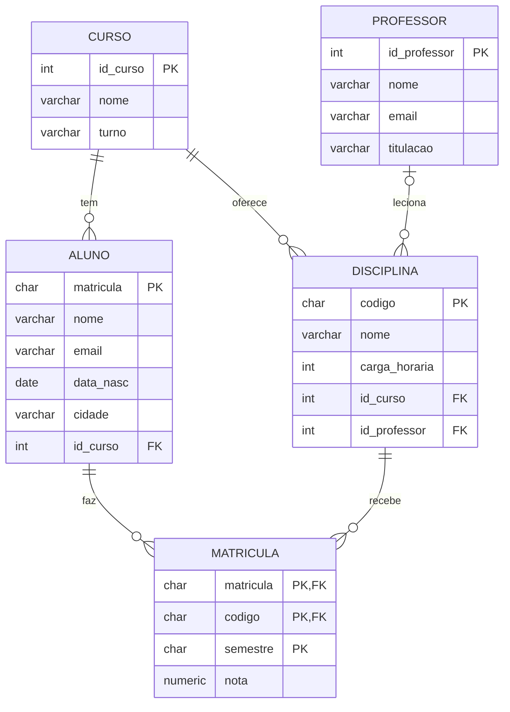

# Fundamentos de Banco de Dados

!!! info "Informações da turma"
    **Semestre:** [2026.2] · **Horário:** [dias e horários] · **Sala:** [sala/laboratório]
    **Carga horária:** [64 h] · **Pré-requisitos:** [Estruturas de Dados / Lógica]

## Ementa

Conceitos de bancos de dados e sistemas gerenciadores (SGBD). Arquitetura em três níveis e independência de dados. Modelagem conceitual com o modelo Entidade-Relacionamento. Modelo relacional e restrições de integridade. Mapeamento ER → relacional. Álgebra relacional. Linguagem SQL: definição (DDL), manipulação (DML) e consultas. Dependências funcionais e normalização. Noções de transações.

## Objetivos

Ao final da disciplina, você será capaz de:

- [x] Explicar o que é um SGBD e suas vantagens sobre arquivos comuns.
- [x] Modelar um problema real com diagramas Entidade-Relacionamento.
- [x] Converter um modelo ER em tabelas do modelo relacional.
- [x] Escrever consultas em álgebra relacional.
- [x] Criar, alterar e consultar bancos de dados em SQL, incluindo junções, agrupamentos e subconsultas.
- [x] Aplicar as formas normais (1FN, 2FN, 3FN) para melhorar um esquema.

## Ambiente de prática

Usaremos o **PostgreSQL**. Escolha uma opção:

=== "Instalar no computador"

    - Baixe em [postgresql.org/download](https://www.postgresql.org/download/) (Windows, macOS ou Linux).
    - Use o `psql` (linha de comando) ou uma interface gráfica como o [DBeaver](https://dbeaver.io/) ou o pgAdmin.

=== "Sem instalar nada"

    - Use um ambiente online como o [DB Fiddle](https://www.db-fiddle.com/) (selecione PostgreSQL), colando o script do banco de exemplo.

### Banco de exemplo: `universidade`

Todas as aulas e listas usam o mesmo banco: cursos, alunos, professores, disciplinas e matrículas.
O script está em [`codigo/banco-de-dados/universidade.sql`](https://github.com/edurdneto/Ciencia-da-Computacao/blob/main/codigo/banco-de-dados/universidade.sql).

```bash
createdb universidade
psql -d universidade -f universidade.sql
```



## Avaliação

| Avaliação | Peso | Conteúdo |
|---|---|---|
| Prova 1 (P1) | [30%] | Modelagem ER, modelo relacional, álgebra |
| Prova 2 (P2) | [30%] | SQL e normalização |
| Listas de exercícios | [20%] | Todas as listas |
| Projeto | [20%] | Modelagem e implementação de um banco completo |

**Média final** = [fórmula]. [Regra de recuperação/exame final.]

## Bibliografia

**Básica**

- ELMASRI, R.; NAVATHE, S. B. *Sistemas de Banco de Dados*. 7. ed. Pearson, 2018.
- SILBERSCHATZ, A.; KORTH, H. F.; SUDARSHAN, S. *Sistema de Banco de Dados*. 7. ed. GEN LTC, 2020.
- HEUSER, C. A. *Projeto de Banco de Dados*. 6. ed. Bookman, 2009.

**Complementar**

- DATE, C. J. *Introdução a Sistemas de Bancos de Dados*. 8. ed. Elsevier, 2004.
- [Documentação oficial do PostgreSQL](https://www.postgresql.org/docs/current/).
