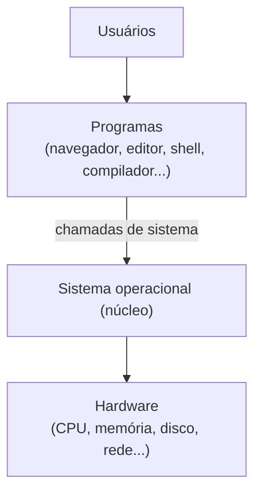

# Aula 01 · Introdução aos Sistemas Operacionais

<div class="resumo-aula" markdown>
[:material-file-pdf-box: Slides (em breve)](#){ .md-button }
[:material-arrow-right: Próxima: Processos](02-processos.md){ .md-button .md-button--primary }
</div>

!!! abstract "Objetivos"
    - Entender o que é um sistema operacional e quais são suas funções.
    - Diferenciar **modo usuário** e **modo núcleo**.
    - Entender o que são **chamadas de sistema**.
    - Conhecer os principais tipos de estrutura de um SO.

## Vídeo da aula

!!! note "Vídeo em breve"
    A gravação desta aula será publicada aqui.

## 1. O que é um sistema operacional?

O sistema operacional (SO) é o software que fica entre o **hardware** e os **programas**. Ele tem dois papéis:

- **Máquina estendida:** esconde a complexidade do hardware e oferece abstrações simples — *arquivos* em vez de setores de disco, *processos* em vez de registradores da CPU.
- **Gerente de recursos:** divide CPU, memória, disco e dispositivos entre vários programas de forma justa, eficiente e segura.



## 2. Modo usuário × modo núcleo

A CPU tem (pelo menos) dois modos de execução:

| | Modo usuário | Modo núcleo (kernel) |
|---|---|---|
| Quem roda | Programas comuns | O núcleo do SO |
| Instruções privilegiadas | ❌ Proibidas | ✅ Permitidas |
| Acesso direto ao hardware | ❌ | ✅ |

Se um programa precisa de algo privilegiado (ler um arquivo, criar um processo, enviar pela rede), ele **pede ao SO** por meio de uma **chamada de sistema**.

## 3. Chamadas de sistema

Uma chamada de sistema (*system call*) é a "porta de entrada" controlada para o núcleo. Exemplos no Linux:

| Categoria | Exemplos |
|---|---|
| Processos | `fork`, `exec`, `exit`, `wait` |
| Arquivos | `open`, `read`, `write`, `close` |
| Diretórios | `mkdir`, `rmdir`, `chdir` |
| Comunicação | `pipe`, `kill`, `socket` |

!!! tip "Veja acontecer"
    O comando `strace` mostra cada chamada de sistema feita por um programa:

    ```bash
    strace -c ls        # resumo das chamadas feitas pelo ls
    strace ls 2>&1 | head -20
    ```

## 4. Estruturas de sistemas operacionais

- **Monolítico:** todo o SO roda em modo núcleo, como um único programa grande (ex.: Linux).
- **Micronúcleo:** só o essencial fica no núcleo; o resto roda como processos em modo usuário (ex.: MINIX 3, QNX).
- **Híbrido:** mistura das duas abordagens (ex.: Windows, macOS).

## Para praticar

1. Liste três abstrações que o SO oferece e o recurso de hardware que cada uma esconde.
2. Por que um programa comum não pode executar instruções privilegiadas? O que aconteceria se pudesse?
3. Rode `strace -c` em dois comandos diferentes e compare as chamadas de sistema mais frequentes.

## Leitura recomendada

- Tanenbaum, *Sistemas Operacionais Modernos*, capítulo 1.
- Silberschatz, *Fundamentos de Sistemas Operacionais*, capítulos 1 e 2.
