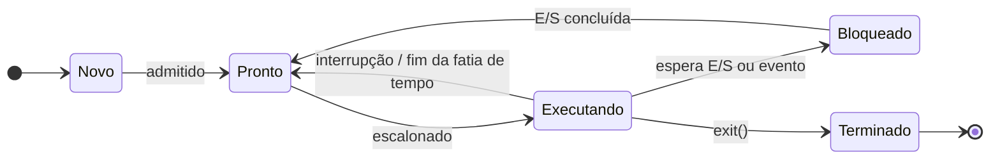

# Aula 02 · Processos

<div class="resumo-aula" markdown>
[:material-file-pdf-box: Slides (em breve)](#){ .md-button }
[:material-github: Código da aula](https://github.com/edurdneto/Ciencia-da-Computacao/tree/main/codigo/sistemas-operacionais/aula-02){ .md-button }
[:material-pencil: Lista 01](../listas/lista-01.md){ .md-button .md-button--primary }
</div>

!!! abstract "Objetivos"
    Ao final desta aula você será capaz de:

    - Diferenciar **programa** de **processo**.
    - Descrever os **estados** de um processo e as transições entre eles.
    - Explicar o que o SO guarda no **PCB** (bloco de controle de processo).
    - Criar processos em C com `fork()`, esperar por eles com `wait()` e trocar o programa com `exec()`.

## Vídeo da aula

<!--
PROFESSOR: para publicar o vídeo, suba no YouTube (pode ser "não listado"),
copie o ID do link (o que vem depois de "v=") e troque o bloco "Vídeo em breve" por:

<div class="video">
  <iframe src="https://www.youtube-nocookie.com/embed/ID_DO_VIDEO" title="Aula 02 · Processos" allowfullscreen></iframe>
</div>
-->

!!! note "Vídeo em breve"
    A gravação desta aula será publicada aqui.

## 1. Programa × processo

Um **programa** é um arquivo parado no disco: instruções e dados. Um **processo** é um programa **em execução**, com tudo o que ele precisa para rodar:

- o **código** (seção *text*);
- os **dados** globais;
- a **pilha** (variáveis locais e chamadas de função);
- o **heap** (memória alocada com `malloc`);
- o **contexto da CPU** (registradores, contador de programa);
- recursos do SO: arquivos abertos, identificador (PID), dono, prioridade...

!!! example "Analogia"
    A receita de bolo é o **programa**. Você na cozinha, com os ingredientes na bancada, seguindo a receita e lembrando em que passo parou, é o **processo**. Duas pessoas podem seguir a mesma receita ao mesmo tempo: são dois processos do mesmo programa.

## 2. Estados de um processo



| Estado | Significado |
|---|---|
| **Novo** | O processo está sendo criado. |
| **Pronto** | Pode executar, só está esperando a vez na CPU. |
| **Executando** | Está usando a CPU agora. Em um núcleo, só um processo por vez. |
| **Bloqueado** | Esperando algo acontecer (leitura do disco, tecla, rede...). |
| **Terminado** | Terminou, aguardando o SO liberar os recursos. |

## 3. O bloco de controle de processo (PCB)

Para cada processo, o SO mantém uma estrutura chamada **PCB** com: PID, estado, contador de programa e registradores salvos, informações de escalonamento, de memória e lista de arquivos abertos.

Quando o SO troca o processo que está na CPU — a **troca de contexto** — ele salva os registradores no PCB do processo que sai e carrega os do processo que entra.

!!! tip "Veja no Linux"
    - `ps aux` lista os processos.
    - `htop` mostra os processos em tempo real.
    - `cat /proc/<PID>/status` mostra parte do "PCB" de um processo. Experimente `cat /proc/self/status`.

## 4. Criando processos em C

### `fork()`: duplicando o processo

`fork()` cria uma **cópia** do processo que a chamou. Depois da chamada, **dois** processos continuam executando a partir da mesma linha. A única diferença é o valor de retorno:

| Retorno de `fork()` | Quem recebe |
|---|---|
| `< 0` | Ninguém — houve erro, nenhum filho foi criado. |
| `0` | O processo **filho**. |
| `> 0` | O processo **pai** (o valor é o PID do filho). |

```c title="codigo/sistemas-operacionais/aula-02/01_fork.c" linenums="1"
--8<-- "codigo/sistemas-operacionais/aula-02/01_fork.c"
```

Uma saída possível:

```text
Antes do fork: sou o processo 431
[pai]   PID=431, meu filho=433, x=5
Fim do processo 431 (x=5)
[filho] PID=433, meu pai=431, x=15
Fim do processo 433 (x=15)
```

!!! warning "Pontos de atenção"
    - **Cada processo tem sua própria cópia de `x`.** O filho somar 5 não afeta o pai. Eles **não compartilham memória**.
    - **A ordem das linhas pode mudar** a cada execução: quem roda primeiro é decisão do escalonador.

??? question "Curiosidade: por que o `fflush(stdout)`?"
    O `printf` não escreve na tela na hora: ele guarda o texto em um **buffer** na memória do processo. No terminal, o buffer é esvaziado a cada `\n`. Mas se você redirecionar a saída (`./01_fork > saida.txt` ou `./01_fork | cat`), ele só é esvaziado no fim.

    Como o `fork()` copia **toda** a memória do processo — incluindo o buffer ainda não escrito — sem o `fflush` a linha "Antes do fork" aparece **duas vezes**. Teste: apague o `fflush`, recompile e rode `./01_fork | cat`.

### `wait()`: esperando o filho

O pai pode aguardar o término de um filho e ler o **código de saída** dele:

```c title="codigo/sistemas-operacionais/aula-02/02_wait.c" linenums="1"
--8<-- "codigo/sistemas-operacionais/aula-02/02_wait.c"
```

!!! info "Processos zumbis e órfãos"
    - **Zumbi:** o filho terminou, mas o pai ainda não chamou `wait()`. O SO mantém uma entrada mínima dele (aparece como `<defunct>` no `ps`).
    - **Órfão:** o pai terminou antes do filho. O filho é "adotado" por outro processo (normalmente o `init`/`systemd`, PID 1).

### `exec()`: trocando o programa

`exec()` **substitui** o programa do processo atual por outro. O PID continua o mesmo, mas código, dados e pilha são trocados. Combinado com `fork()`, é assim que o shell executa os seus comandos:

```c title="codigo/sistemas-operacionais/aula-02/03_exec.c" linenums="1"
--8<-- "codigo/sistemas-operacionais/aula-02/03_exec.c"
```

## Rodando os exemplos

```bash
cd codigo/sistemas-operacionais/aula-02
make            # compila os três exemplos
./01_fork
./02_wait
./03_exec
make clean      # apaga os executáveis
```

## Para praticar

1. Quantas vezes "Olá" é impresso pelo código abaixo? Desenhe a árvore de processos.
    ```c
    fork();
    fork();
    printf("Olá\n");
    ```
2. Modifique o `02_wait.c` para o pai criar **3 filhos** e esperar todos eles.
3. Rode `03_exec` trocando `ls -l` por outro comando de sua escolha.

??? success "Resposta do exercício 1"
    **4 vezes.** O primeiro `fork()` gera 2 processos; cada um executa o segundo `fork()`, totalizando 4 processos, e cada um imprime uma vez. Em geral, *n* chamadas de `fork()` em sequência geram 2ⁿ processos.

Os exercícios avaliados estão na [Lista 01](../listas/lista-01.md).

## Leitura recomendada

- Tanenbaum, *Sistemas Operacionais Modernos*, seção 2.1.
- Silberschatz, *Fundamentos de Sistemas Operacionais*, capítulo 3.
- OSTEP, capítulos [4 (Processes)](https://pages.cs.wisc.edu/~remzi/OSTEP/cpu-intro.pdf) e [5 (Process API)](https://pages.cs.wisc.edu/~remzi/OSTEP/cpu-api.pdf).
