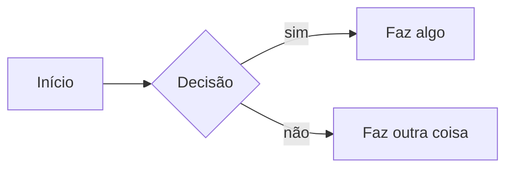

# Aula NN · Título da aula

<!--
COMO USAR ESTE MODELO
1. Copie este arquivo para docs/<disciplina>/aulas/NN-tema.md
2. Preencha o conteúdo e apague o que não usar.
3. Adicione a aula ao menu em mkdocs.yml (seção "nav") e transforme o tema em link no cronograma.
-->

<div class="resumo-aula" markdown>
[:material-file-pdf-box: Slides](../arquivos/NOME-DO-ARQUIVO.pdf){ .md-button }
[:material-github: Código da aula](https://github.com/edurdneto/Ciencia-da-Computacao/tree/main/codigo/DISCIPLINA/aula-NN){ .md-button }
[:material-pencil: Lista NN](../listas/lista-NN.md){ .md-button .md-button--primary }
</div>

!!! abstract "Objetivos"
    Ao final desta aula você será capaz de:

    - Objetivo 1.
    - Objetivo 2.

## Vídeo da aula

<div class="video">
  <iframe src="https://www.youtube-nocookie.com/embed/ID_DO_VIDEO" title="Aula NN" allowfullscreen></iframe>
</div>

## 1. Primeiro tópico

Texto explicativo.

!!! tip "Dica"
    Caixas disponíveis: note, abstract, info, tip, success, question, warning, failure, danger, bug, example, quote.
    Use ??? no lugar de !!! para uma caixa que começa fechada (bom para respostas).

## 2. Código

Para mostrar um arquivo da pasta codigo/ sem copiar e colar (ele se atualiza sozinho):

```c title="codigo/DISCIPLINA/aula-NN/exemplo.c" linenums="1"
--8<-- "codigo/DISCIPLINA/aula-NN/exemplo.c"
```

Ou escreva o código direto:

```python
print("Olá")
```

## 3. Diagrama



## Para praticar

1. Exercício rápido.

??? success "Resposta"
    Resposta do exercício.

## Leitura recomendada

- Livro, capítulo X.
